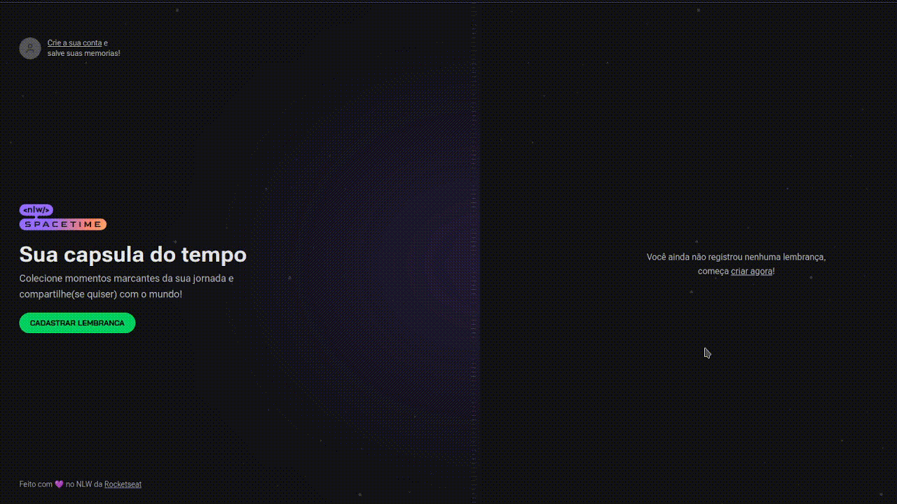

<h1 align="center">
    
</h1>


<p align="center">
  <a href="https://www.linkedin.com/in/emanuel-magalh%C3%A3es-aa3954b8/"></a>

</p>

<p align="center">
  <a href="#-sobre-o-projeto">Sobre o projeto</a>&nbsp;&nbsp;&nbsp;|&nbsp;&nbsp;&nbsp;
  <a href="#-tecnologias">Tecnologias</a>&nbsp;&nbsp;&nbsp;|&nbsp;&nbsp;&nbsp;
  <a href="#-iniciando">Iniciando</a>&nbsp;&nbsp;&nbsp;|&nbsp;&nbsp;&nbsp;
  <a href="#-como-contribuir">Como contribuir</a>&nbsp;&nbsp;&nbsp;|&nbsp;&nbsp;&nbsp;
  <a href="#-license">License</a>
</p>


<p align="center">
  
</p>

## 🧸 Sobre o projeto

 Spacetime é um projeto desenvolvido durante a edição Spacetime da Next Level Week (Trilha Ignite), evento organizado pela 🚀 [Rocketseat](https://rocketseat.com.br/).

A ideia do App é de ser uma viagem no tempo onde voce compartilha suas melhores memorias e as organiza em uma timeline, tendo ainda a possibilidade de tornar
essas memorias publicas e compartilhar com amigos.

## 🚀 Tecnologias

- [Node.js](https://nodejs.org/en/)
- [ReactJS](https://reactjs.org/)
- [TypeScript](https://www.typescriptlang.org/)
- [NextJS](https://nextjs.org/)
- [ReactNative](https://reactnative.dev/)
- [Expo](https://expo.dev/)
- [Tailwindcss](https://tailwindcss.com/)
- [Prisma](https://www.prisma.io/)

## 💻 Iniciando

Instale o Node.js em uma versao LTS, e dentro da pasta do projeto rode `npm install` para instalar as dependencias e depois `npm run dev` para 
a versao web e `npm run start` para mobile.

### Requirements

- [Node.js](https://nodejs.org/en/)


```bash
$ git clone git@github.com:rayzen2002/time_capsule.git && cd time_capsule
```

**Siga os Passos a seguir**


### Web


```bash
# Iniciando pela pasta root do projeto 


# Instale as dependencias
$ npm install


$ npm run dev
```


## 🤔 Como contribuir

**Faça um fork deste repositório**

```bash
# Fork usando linha de comando oficial do GitHub 
# Se você nao tem a CLI, use o site para fazer isso.

$ gh repo fork rayzen2002/time_capsule
```

**Siga os passos a seguir**

```bash
# Clone seu fork
$ git clone git@github.com:rayzen2002/time_capsule.git && cd time_capsule

# Crie uma branch com sua feature
$ git checkout -b my-feature

# Faça o commit com suas mudanças
$ git commit -m 'feat: My new feature'

# Mande o código para sua branch remota
$ git push origin my-feature
```

Após sua pull request ser merged, voce pode deletar sua branch

## 📝 License

This project is licensed under the MIT License - see the [LICENSE](LICENSE) file for details.

---

## Autor
Emanuel Magalhaes

[LinkedIn](https://www.linkedin.com/in/emanuel-magalh%C3%A3es-aa3954b8/)


